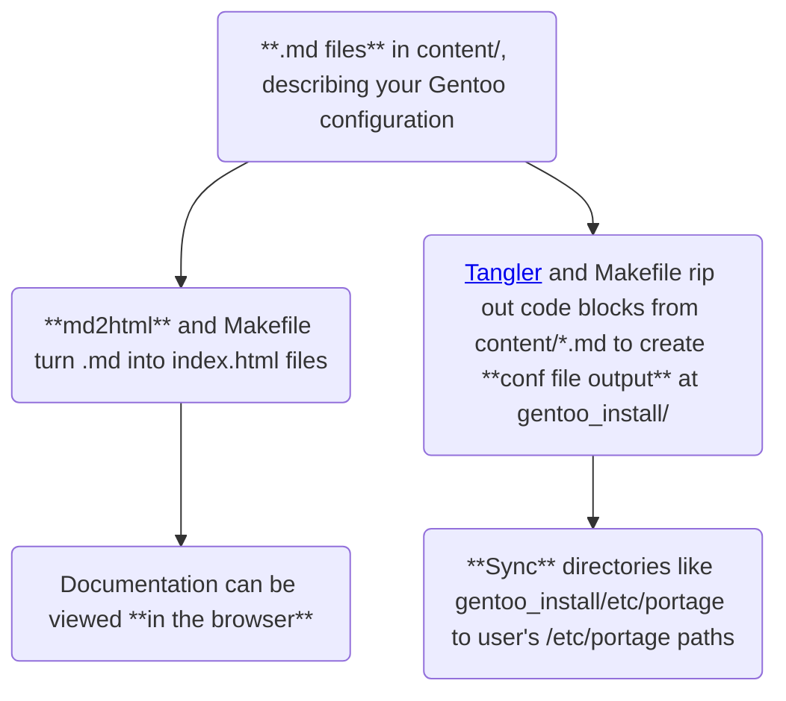

# funroll

A [literate programming](https://wikipedia.org/wiki/Literate_programming)
framework for Gentoo.

## The problem

On Gentoo, setting up a specialized package install might take flags in
`package.accept_keywords`, `package.use`, or `/etc/portage/patches`.
Wouldn't it be nice to have one source of truth for this package, well-documented and decorated?

That's where a knowledge base, exportable to both HTML and Gentoo confs, comes in. And
unfortunately, `emacs` org-mode just barely misses the following design goals:

* **Easy.** A user should be able to `make` and `make sync` without installing
  extra dependencies within a Gentoo stagefile.
  * No emacs!?
* **Light.** A user should be able to run this on any constrained system that
  Gentoo supports. C and GNU utilities are preferred.
  * No large-scale static site generators!?
* **Extensible.** Code should be succinct, hackable, and stable even such.
  * No massive C++ libraries!?

## The solution

See the graph above :).

## Usage

This is not ready for use. Here is our todo list:

- [ ] Set up md2html Markdown-to-web step
  - [x] Vendor [mity/md4c](https://github.com/mity/md4c) for Markdown parsing
  - [x] Output some content/a/b/file.md to some web_root/a/b/file/index.html in parallel
  - [x] Add sitemap.xml
  - [ ] Implement CSS (80% done, needs code block styling improvements)
  - [ ] Add visual header and footer
  - [ ] External links open in new tab
  - [ ] Add search bar
  - [ ] Add syntax highlighting
- [ ] Set up deployment step
  - [ ] GitHub workflow
  - [ ] Codeberg workflow
- [ ] Set up tangle step
  - [x] Extract from triple-backticked blocks: \`\`\`lang path=/etc/portage/somepath...
  - [ ] Extract from HTML `<code path="/etc/portage/somepath"><pre>`
  - [x] Write to files as specified in the path=.
    - [x] Add unit tests
    - [ ] Flesh out unit tests
- [ ] Set up sync step
  - [ ] Show diffs
  - [ ] Help user resolve large transactions (e.g. when a package adds a savedconfig, outside of funroll control)
  - [ ] Deal with (delete?) system conf files when their respective code blocks are removed from the user's knowledge base
- [ ] Create wiki to help Gentoo users hack this to their needs
  - [ ] Create a graph of the project's _internal_ workings, not just its goals.

## Licensing

GPLv3. Inclusions of differently-licensed material in this project are appropriately licensed.
